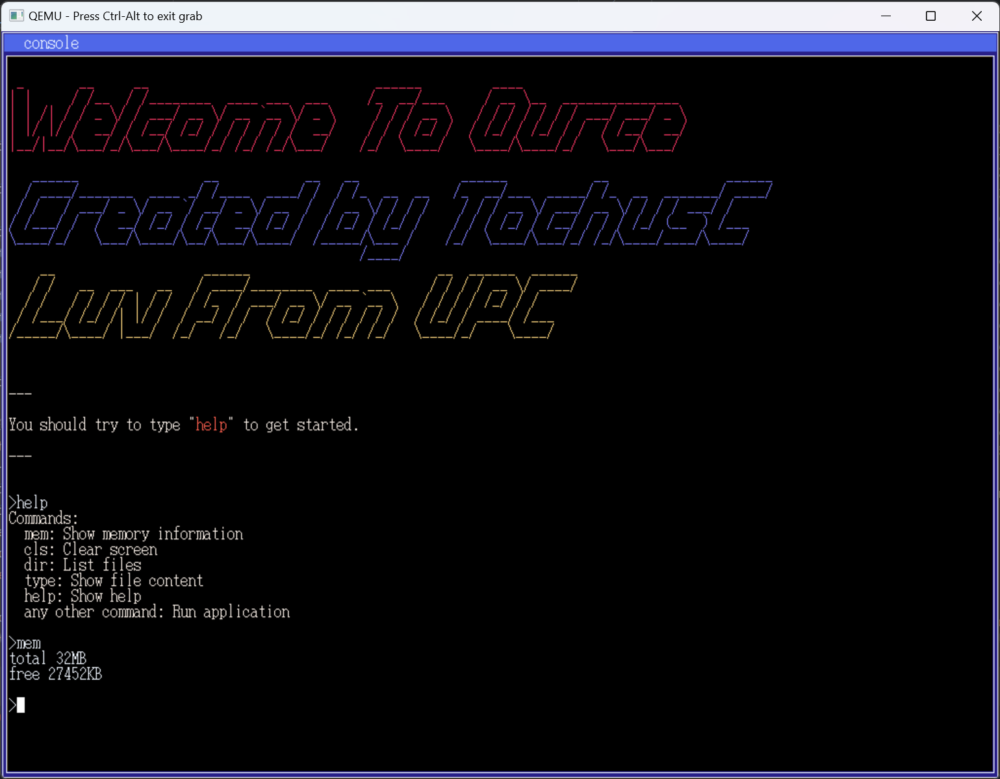
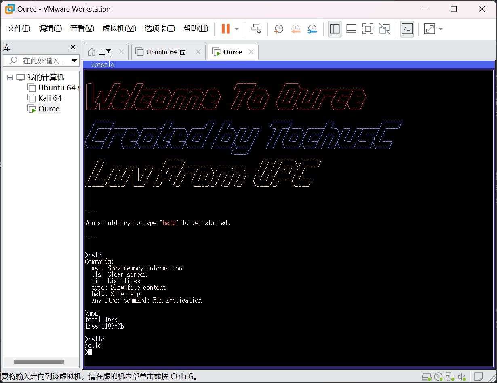

<div align="center">


<h1 style="margin-top: 0"> Ourse </h1>

### 可能是最简单基础的操作系统，但 100% Lovingly Crafted❤️


[](https://github.com/TochusC/ource)
[](https://www.upc.edu.cn/)


[](https://github.com/TochusC)


[**简体中文**](./README.md) 


[中国石油大学(华东)](https://upc.edu.cn/)-[操作系统满分课设(100分)]

</div>




---
<div align="center">

### 阶段性完工🔨...


Ource操作系统参考自川合秀实编著，周自恒翻译的[30天自制操作系统](https://viterbi-web.usc.edu/~yudewei/main/sources/books/30%E5%A4%A9%E8%87%AA%E5%88%B6%E6%93%8D%E4%BD%9C%E7%B3%BB%E7%BB%9F/)中的Haribote（纸娃娃）系统编写，所参考的中文源码来自[
yourtion的git仓库](https://github.com/yourtion/30dayMakeOS)。

感谢书籍编写者、译者、中文源码分享者的贡献！

</div>

## 项目结构📁
```angular2html
docs  # README相关文件
├── img 

projects  #《30天自制操作系统》的中文源码

release  # 发布版本
├──ource.iso # 发布的镜像文件（可用VMware Workstation等虚拟机软件运行）
├──ource.img # 发布的软盘镜像文件

tolset # 《30天自制操作系统》的工具集
├── ource_core # 操作系统核心代码
├── others # 其他工具


```


## 目前进度🚀

Ource实现了操作系统内核应提供的支撑功能：中断处理、时钟管理、原语操作和资源管理功能。


### 支撑功能

---

#### 中断处理
通过设置中断向量表，实现了对中断的处理，目前支持的中断信号有：
- 异常中断 中断信号0x0d
- 时钟中断 中断信号0x20
- 键盘中断 中断信号0x21
- 鼠标中断 中断信号0x2c（支持但未使用）
- 电气中断 中断信号0x27
- 系统调用 中断信号0x40


#### 时钟管理
Ource OS支持时钟中断，通过设置8254定时器，实现了对时钟中断的处理，以及对任务的调度。

#### 原语操作
Ource OS实现了对原语操作的支持，通过io_cli和io_sti函数可以设置中断屏蔽标志位，进行关中断和开中断，执行相应原语操作。


### 资源管理

---

#### 处理器管理

Ource OS是一个多任务操作系统，其通过**多级优先队列调度算法**实现任务的调度，采用**时间片轮转**的方式进行任务切换。
具有高优先级的任务将会被分配到更多的时间片，以保证其能够更快地完成任务。

#### 内存管理

Ource OS采用**分段存储管理**的方式进行内存管理，通过设置全局段表，将操作系统和应用程序分配在具有不同权限的段中，以进行内存的管理和分配。

#### 设备管理
Ource OS支持**键盘输入**，并通过**中断**的方式进行设备管理。

#### 文件管理
Ource OS采用**FAT12**文件系统进行文件管理，目前仅支持文件的读取等操作。

#### 支持的系统调用
- `api_putchar` 输出字符
- `api_putstr0` 输出字符串

## 更多细节🔍


以《30天自制操作系统中的》.hrb文件格式作为系统的可执行文件，使用其提供的tolset工具集进行编译和链接。

通过设置不同应用程序的内存段属性，实现操作系统和应用程序之间的隔离与保护。

通过中断实现系统调用，目前提供了往控制台终端输出字符和换行的系统调用函数api_putchar和api_end;

### 目前支持的指令
```
help # 查看帮助
cls # 清屏
dir # 查看当前目录下的文件
type # 查看文件内容
mem # 查看内存使用情况
```

## 如何运行❓
`release`文件夹中提供了`ource.iso`镜像文件，可用VMware Workstation等虚拟机软件运行。


