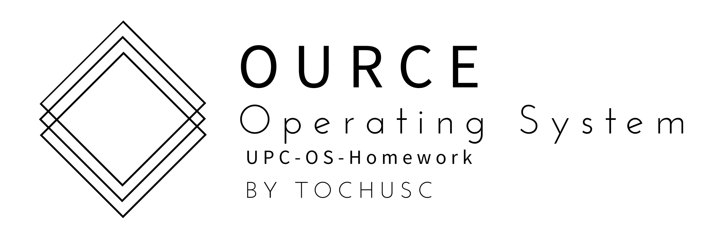

---

<h1 style="margin-top: 0"> Ourse </h1>

### 可能是最最简陋的操作系统

[**简体中文**](./README.md) 

[中国石油大学(华东)](https://upc.edu.cn/)-操作系统结课作业

Ource操作系统参考自川合秀实编著，周自恒翻译的[30天自制操作系统](https://viterbi-web.usc.edu/~yudewei/main/sources/books/30%E5%A4%A9%E8%87%AA%E5%88%B6%E6%93%8D%E4%BD%9C%E7%B3%BB%E7%BB%9F/)中的OSASK系统编写，感谢书籍编写者和译者的贡献！

---

### 仍在火热施工中🔨...

## 目前进度

---

#### 现在它可以调用显卡并渲染"WELCOME TO OURSE"的字样了！

